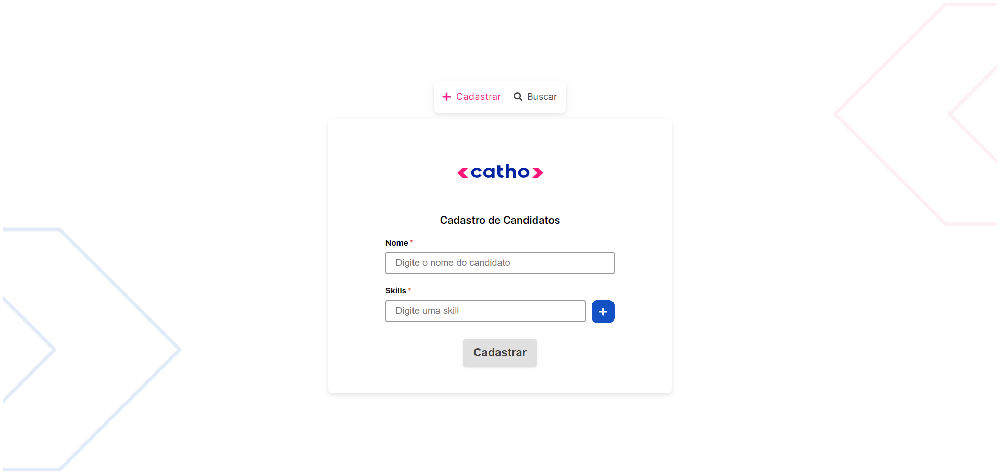
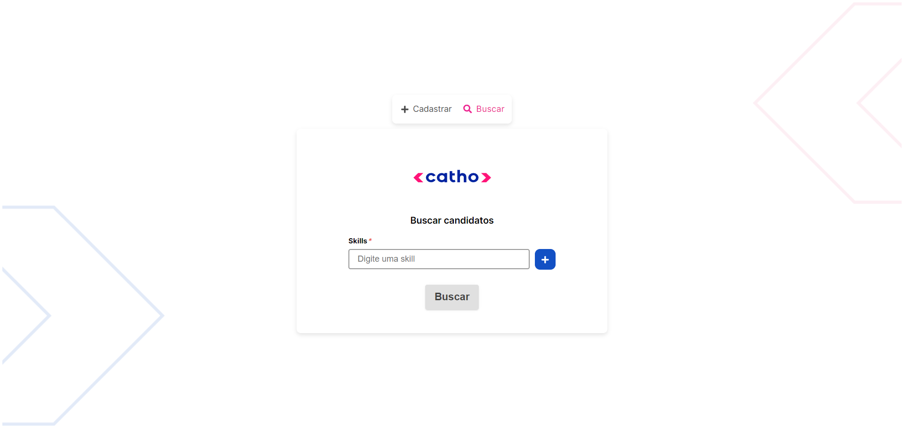
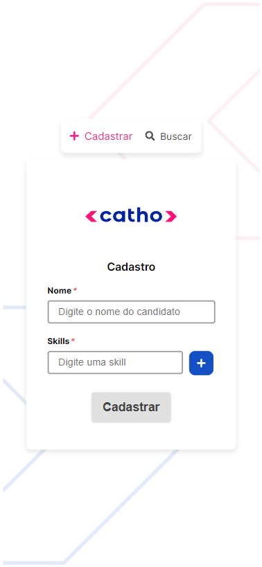
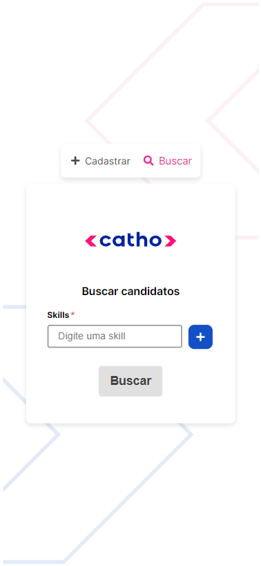

## Layout web

 
 


## Layout mobile
 
 

## 🛠️ Tecnologias

⚡️ **Stack**
- [Next.js 14.0.0](https://nextjs.org)
- [Typescript](https://www.typescriptlang.org)
- [Node.js 20.11.0](https://nextjs.org)
- [ESLint](https://eslint.org)
- [Prettier](https://prettier.io)

📚 **Bibliotecas**
- [yup](https://www.npmjs.com/package/yup)
- [mysql2](https://www.npmjs.com/package/mysql2)
- [react-hook-form](https://react-hook-form.com/)
- [react-icons](https://react-icons.github.io/react-icons/)


🎨 **Estilização**

🔋 **Versionamento e Deploy**
- [Git](https://git-scm.com)

Certainly! You can add the following steps to your README to guide users through the configuration and setup process:

---

## ⚙️ Configurações e Instalações

### 1. Clone do Projeto

```bash
$ git clone https://github.com/RichardMath99/CandidateNextjs
```

### 2. Instalando as dependências

```bash
$ npm install
```

### 3. Configurando o Banco de Dados com Docker

Certifique-se de ter o Docker instalado em sua máquina. Execute o seguinte comando para subir o banco de dados MySQL em um contêiner Docker:

```bash
$ docker-compose up -d
```

### 4. Criando o Banco de Dados

Execute o seguinte comando para criar o banco de dados:

```bash
$ node server/database/index.js
```

Isso completa a configuração e instalação do projeto. Agora você está pronto para iniciar o projeto:

### 5. Iniciando o Projeto

```bash
$ npm run dev
```

O projeto estará acessível em [http://localhost:3000](http://localhost:3000).
